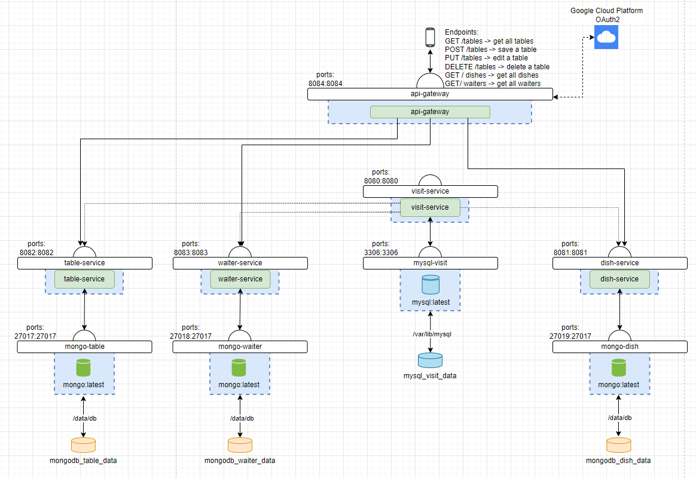
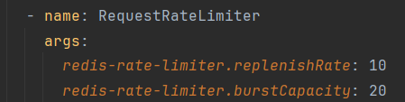

# EnterpriseBackend
# Table of Contents
* [Introduction](#introduction)
* [Java Structure](#java-structure)
    * [UML](#UML)
    * [Folder Structures](#folder-structures)
* [CI/CD & Deployment](#deployment)
	* [Dockerfile](#dockerfile)
* [Services and Databases](#services)
* [Extras](#extras)
	* [Frontend](#frontend)
	* [Manifest files](#kubernetes)
	* [Rate limiting](#rate-limiting)
## Introduction 

    For this project, we've crafted a sophisticated microservices backend. Our backend comprises four distinct microservices that collectively shape the fundamental structure of a restaurant: visits, waiters, tables, and dishes. Each of these services has its own dedicated database. All conceivable requests are seamlessly handled by a custom-built gateway.

## Java structure 
### UML 

    Our stucture is based on this UML model, although it is not 100% faithful to the model, it shares the same idea.

    

### Folder structures 

    

    

    

    

    You can see that in each service the folders are very similar, they all have: controller, dto, model, repository and service

<ul>
    <li><strong>controller:</strong> Handles incoming HTTP requests, manages the flow of data, and interacts with the service logic to fulfill client requests.</li>
    <li><strong>dto:</strong> Contains Data Transfer Objects, which define the data structure for communication between different layers of the application, often used to transfer data between the controller and service layers.</li>
    <li><strong>model:</strong> Houses the data models or entities representing the core data structures used by the service. These models typically map to database tables or other data storage structures.</li>
    <li><strong>repository:</strong> Manages the interaction with the database, including querying, saving, and updating data. This folder often contains classes or interfaces that define the data access methods.</li>
    <li><strong>service:</strong> Implements the business logic of the service. It contains the application's main functionality, handling tasks such as data validation, processing, and interaction with the repository to perform CRUD (Create, Read, Update, Delete) operations.</li>
</ul>

## CI/CD & Deployment 

    The next step is to create automation using docker and docker-compose files.

### Dockerfile 

    Each service has a dockerfile that is used to create Docker images of said services within our Java application.

## Total services and databases 

   In the following schema each service in detail along with its database can be found. The created endpoints within the gateway are also specified.

   

   Services:

<ul>
   <li>api-gateway</li>
   <li>visit-service</li>
   <li>dish-service</li>
   <li>waiter-service</li>
   <li>table-service</li>
</ul>

   Volumes and databases:

<ul>
   <li>mongo-table</li>
   <li>mongo-waiter</li>
   <li>mongo-dish</li>
   <li>mysql-visit</li>
   <li>mongodb_table_data</li>
   <li>mongodb_waiter_data</li>
   <li>mongodb_dish_data</li>
   <li>mysql_visit_data</li>
</ul>

## Extras 

	We have a couple of additions in our project.

### Frontend 

	We have a frontend which uses data from dish-service: https://6599be996270e612a52753e5--steady-belekoy-b94338.netlify.app/.

### Kubernetes manifest files 

	We converted our docker-compose file to multiple manifest files, as you can see below.
	
	

### Rate limiting 

	We added rate limiting to our project.
	

	

